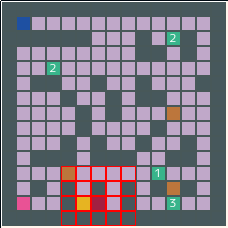

# スモウルビー甲子園 検証用マップ

Youtube の [ノッカー・ワークスの「ちょっと工数いいですか？」](https://www.youtube.com/channel/UC39VYENjiYRv9NvD4M5ncRg)チャンネルで配信している  
「ちょっと本気のスモウルビー甲子園」シリーズで検証として使用しているマップ集です。  
各マップにはサンプル AI の得点も乗せていますので、  
自分の作った AI でその得点を超えることが出来るかなどを検証してみると良いかもしれません。

## マップ一覧

|マップ|マップについての解説|番組配信リンク|
|:-:|:--|:--|
||[A-1 マップ解説](./exam_a_1/exam_a_1.md)|[ちょっと本気のスモウルビー甲子園 #3](https://youtu.be/W98qJdOBbCg)|
