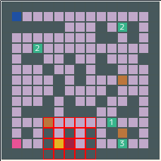

# 試験 A - 1 マップ

## 目標

1. ラウンド１＆２共に、ゴールする
2. マップを素早く調べて素早く動く
3. 早いもの勝ちのアイテムを取れるように

|対戦相手AI|ラウンド１得点|ラウンド１ゴール|ラウンド２得点|ラウンド２ゴール|
|:--|:-:|:-:|:-:|:-:|--:|
|サンプル AI 3|100 以上|◎|130 以上|◎|

## マップ解説

* ２つある「２」のアイテムは両方とも、ラウンド１のプレイヤーから１１歩の位置にある。  
  また、左の「２」はラウンド２側のプレイヤーからも１１歩の位置にある。
* アイテムを取る順番、動き始める速度で勝敗が決まるので、マップの探索方法や動き始めるタイミングが重要
* また、壊せる壁を壊すことで、歩数を短くすることも出来るので、さらなる得点アップには挑戦してもらうと良い